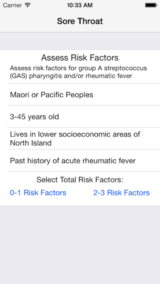
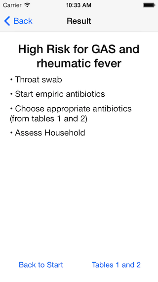

A very basic app built almost entirely within the Storyboard.  This was built as a proof of concept for medical flow-chart style evaluations. 

This app follows the sore throat management flowchart available here: [http://www.heartfoundation.org.nz/uploads/Algorithm_4_A_Guide_for_Sore_Throat_Management.PDF]

 